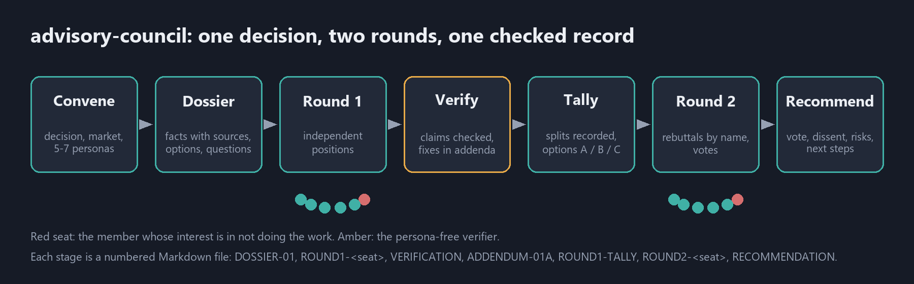

# tvr-skills-agent-advisory-council: an advisory board Agent Skill for Claude Code

An Agent Skill and Claude Code plugin that convenes a simulated advisory council on a decision.
Claude seats stakeholder personas (C-suite roles, the board, target customers and market
segments, competitors, activist investors and critics, regulators, partners, domain experts),
gives them one shared dossier, collects independent positions, fact-checks the claims, runs a
second round of rebuttals and votes, and writes a recommendation that keeps the dissent. Use it
as a board of advisors, a stakeholder review or a red team for product, business, technical,
policy and research decisions.

[](https://github.com/nzanepro/tvr-skills-agent-advisory-council/actions/workflows/tests.yml)



## Skills

| Skill | What it does |
|---|---|
| [`advisory-council`](advisory-council/SKILL.md) | Runs a two-round advisory council with a persona-free fact check and writes the whole session as numbered Markdown files |

## Run an advisory board with Claude

### What it does

- **Asks for the market and the groups.** The subject and decision, the market and geography,
  the goal and constraints, the evidence you have, and which stakeholder groups sit on the
  council. If you give little, it proposes a council in one short message for you to confirm or
  edit, instead of a questionnaire.
- **Personas with a mandate, not just a job title.** Each seat has incentives, knowledge, blind
  spots, red lines and the evidence that would change its mind. Every council includes a seat
  that argues against doing the work and a seat for the party with the least voice.
- **One checked record.** Members work from one dossier, are asked to find its errors, and a
  persona-free verifier checks every load-bearing claim. Corrections go into numbered addenda.
- **Independent, then informed.** Round 1 positions are written without seeing each other; Round
  2 answers the others by name and votes on lettered options.
- **Dissent kept at full strength.** The recommendation gives the vote by headcount and weight,
  each dissent as its holder would put it, risks, open questions, and next steps that each say
  what result would change the decision.
- **Parallel or single agent.** One subagent per member where the host supports it (Claude
  Code), or a single-agent protocol elsewhere.

**Use it for:** product strategy and pricing decisions; go-to-market and market-entry choices;
build vs buy; launch / no-launch reviews; a mock board meeting or investor review; stakeholder
analysis for a policy proposal; research design review; architecture and dependency decisions;
red-teaming a plan before you commit. Seat menus cover business and product, engineering, public
policy and research; you can add, remove and weight seats.

### How it works

1. **Convene.** Agree the decision, the market and 5-7 seats plus the verifier. `council.py init`
   writes the roster and a stub for every file.
2. **Dossier.** The question, the options (including doing nothing), facts with sources,
   estimates with methods, unknowns, and numbered questions.
3. **Round 1.** Each member writes an independent position and says where the dossier is wrong.
4. **Verify.** The verifier checks the load-bearing claims; corrections are published as
   `ADDENDUM-01A` (corrections only, never votes).
5. **Tally.** Written only after every member has reported: agreements, splits recorded without
   adjudication, what each seat added, and lettered options that include the strongest dissent.
6. **Round 2.** Members read each other, respond by name and vote.
7. **Recommend and check.** `council.py tally` counts the votes, the recommendation is written,
   and `council.py check --final` confirms the file set follows the rules.

### What you get

```
council/
  council.json                      roster: seats, groups, weights
  COUNCIL.md                        the decision, roster, persona cards, session rules
  DOSSIER-01-<topic>.md             the shared factual record
  ROUND1-<seat>.md                  one independent position per seat
  VERIFICATION.md                   claim-by-claim check: CONFIRMED / CONTRADICTED / MISLEADING / UNVERIFIED
  ADDENDUM-01A.md                   numbered corrections that win over the dossier
  ROUND1-TALLY.md                   positions, splits, options A / B / C
  ROUND2-<seat>.md                  responses and votes
  RECOMMENDATION.md                 start here: vote, dissent, risks, open questions, next steps
```

A complete session on a fictional product is in
[`advisory-council/references/example/`](advisory-council/references/example/).

## Requirements

| Need | Check |
|---|---|
| An Agent Skills client; Claude Code for parallel member subagents | `claude --version` |
| Python 3.9 or later for the helper script (standard library only; optional) | `python --version` |
| Web access for the verifier (optional; without it, claims are marked UNVERIFIED) | |

## Install the Claude Code plugin

**Claude Code plugin marketplace (recommended).** Inside Claude Code:

```
/plugin marketplace add nzanepro/tvr-skills-agent-advisory-council
/plugin install council@tvr-skills-agent-advisory-council
```

Free and MIT-licensed. If it saves you time, you can [buy me a coffee](https://buymeacoffee.com/trespassvr).

**Install before you start a session.** Claude Code loads skills and plugins when a session starts, so they work best when installed first. If you install one during a session, start a new session before asking for it.

Plugin skills are namespaced, so the skill is `/council:advisory-council`.

From your shell instead of a session:

```bash
claude plugin marketplace add nzanepro/tvr-skills-agent-advisory-council
claude plugin install council@tvr-skills-agent-advisory-council
```

**Update the plugin.** Auto-update is off by default for this marketplace. To get a new
version, run `/plugin`, open the **Installed** tab, select `council` and choose **Update now**,
or from your shell run:

```bash
claude plugin update council@tvr-skills-agent-advisory-council
```

The new version loads in your next session, or after `/reload-plugins`. To have Claude Code
update it for you, open the **Marketplaces** tab in `/plugin`, select
`tvr-skills-agent-advisory-council` and choose **Enable auto-update**.

**Personal skill** (every project), from a clone in your home folder:

```bash
cd ~
git clone https://github.com/nzanepro/tvr-skills-agent-advisory-council
mkdir -p .claude/skills
cp -r tvr-skills-agent-advisory-council/advisory-council .claude/skills/
```

**Linked copy**, so a `git pull` updates the skill (Claude Code follows linked skill folders).
Run the first three lines above, then link the folder instead of copying it:

```bash
ln -s ~/tvr-skills-agent-advisory-council/advisory-council ~/.claude/skills/advisory-council
```

On Windows, in PowerShell:

```powershell
cd ~
git clone https://github.com/nzanepro/tvr-skills-agent-advisory-council
New-Item -ItemType Directory -Force .claude\skills
cmd /c mklink /J .claude\skills\advisory-council tvr-skills-agent-advisory-council\advisory-council
```

If you clone somewhere else, change the paths to match.

**Project skill**: copy `advisory-council/` into `<project>/.claude/skills/advisory-council/` and
commit it, so everyone on the project gets the same council process.

**Other Agent Skills clients**: copy `advisory-council/` into that client's skills folder (see
[agentskills.io](https://agentskills.io)). The folder is self-contained.

**claude.ai**: download `advisory-council-<version>.zip` from the
[latest release](https://github.com/nzanepro/tvr-skills-agent-advisory-council/releases/latest)
(or zip the `advisory-council/` folder yourself) and upload it as a custom skill. There it runs
in single-agent mode, since members cannot be separate subagents.

## Usage: convene an advisory council

Ask in plain words:

- "Set up an advisory board to review whether we should add a paid tier."
- "Give me a board-of-directors style review of our plan to expand into Germany: CFO, a
  sceptical investor and two customer segments."
- "How would our target customers, a big competitor and the regulator react if we dropped the
  free plan? Run it as a council with a vote."
- "Red-team the migration plan: the ops team, the maintainers, a customer and a devil's advocate,
  two rounds."
- "Get the council back together on the pricing follow-up, same seats."

Or call it directly: `/advisory-council` (personal or project install) or
`/council:advisory-council` (plugin). If it does not trigger on its own, ask for the
advisory-council skill by name.

<details>
<summary>Worked example: a fictional leak-sensor maker decides whether to charge for alerts</summary>

The example in [`advisory-council/references/example/`](advisory-council/references/example/)
is a fictional company deciding whether phone alerts for its sensor should move to a subscription.
Six seats sat: CFO, home owner (weight 2), small landlord, insurance partner, a large smart-home
platform (competitor archetype) and a consumer advocate, plus the verifier.

- **The dossier was wrong in ways that mattered.** Members and the verifier found a pilot
  take-up rate quoted from one cohort, a churn figure true only for annual billing, a yearly
  competitor price in a monthly column and two swapped country rows. `ADDENDUM-01A` corrected
  them, and the projected run rate for the CEO's preferred option fell by about two thirds.
- **The leading option drew no votes.** After the corrections the CEO's preferred option
  (subscription for new customers) got no support. The CFO changed its vote in Round 2 and
  named the addendum items that moved it.
- **Result:** option C (a small price rise, push alerts free for everyone, an optional paid
  escalation tier built in stages), 5 of 6 seats, weighted 6 of 7. The insurance partner
  dissented for option B. The recommendation keeps that dissent, the risks, and the desk checks
  that would change the decision.

</details>

## Using the script without an agent

```bash
python advisory-council/scripts/council.py --help
python advisory-council/scripts/council.py init council --title "Launch a paid tier" \
  --seat cfo:"Chief Financial Officer":Leadership \
  --seat smb:"Small-business owner (target segment)":Customers:2 \
  --seat advocate:"Consumer advocate":Critics
python advisory-council/scripts/council.py status council
python advisory-council/scripts/council.py addendum council
python advisory-council/scripts/council.py tally council --round 2
python advisory-council/scripts/council.py check council --final
```

`init` never overwrites a file, so it is safe to re-run. `tally` and `check` exit 3 when a seat
has not reported or a process rule is broken (a vote in an addendum, a tally written before every
Round 1 report, a changed vote with no named reason, a recommendation missing its dissent). Add
`--json` to any command for machine-readable output.

## Ethics and limits

- **Simulated perspectives are hypotheses, not research.** A persona's view is not what real
  customers, investors or regulators think. The recommendation lists the real-world checks
  (interviews, counsel, data) that should follow.
- **No real named people.** The council seats roles and organisation types, never a named
  individual. Real companies appear only as labelled competitor-perspective archetypes built from
  public information, with no invented internal facts or quotes.
- **Not professional advice.** Legal, tax, medical and investment questions are flagged and
  referred to a qualified professional.
- **Cost.** A six-seat council is about fourteen member runs. For small decisions the skill
  offers a light version (fewer seats, one round), and says what it skipped.

## What it runs and what it sends

- **Files.** The skill writes the council's Markdown files into one folder in your project
  (`council/` unless you choose another) and changes nothing else.
- **Script.** `council.py` runs locally with the Python standard library. It reads its own
  templates and any roster file you name, writes only inside the council folder, and makes no
  network calls.
- **Network.** The plugin has no hooks, MCP servers or background processes and sends nothing
  anywhere itself. The verifier may use your Claude client's own web search or fetch tools, when
  you have them and allow them, to check claims in the dossier. Your decision and dossier go to
  the model like any other prompt.

See [SECURITY.md](SECURITY.md) to report a problem.

## Troubleshooting

- **Members agree on everything**: check that the contrarian seat argued its case and that the
  dossier did not frame the answer (see `references/facilitation.md`); then re-run Round 1 for the
  seats that echoed the dossier.
- **`tally` exits 3**: a seat's report is missing, still carries `<!-- council:todo -->`, or has
  no filled `**Position:**` / `**Vote:**` line. Re-run that member.
- **`check` says an addendum carries a vote**: move the position into the member's round file;
  addenda hold corrections only.
- **You asked for a named person**: the skill seats the archetype instead and says why.
- **The skill does not trigger**: ask for the advisory-council skill by name, or use the slash
  command.
- **An update did not take effect**: the running session keeps the version it loaded. Start a new
  session or run `/reload-plugins`; `claude plugin list` shows the installed version.

## Development

```bash
python -m pip install pytest pyyaml
python -m pytest tests -q
```

CI runs the tests on Windows, macOS and Linux. PyYAML is optional locally: with it, the tests
also parse the `SKILL.md` frontmatter as YAML. Trigger evals (prompts that should and should not
load the skill, focused on near misses such as a single quick opinion, summarising real
interviews or role-playing a named person) are in
[`evals/trigger-queries.json`](evals/trigger-queries.json) in the skill-creator format.

The plugin manifest is [`.claude-plugin/plugin.json`](.claude-plugin/plugin.json);
[`.claude-plugin/marketplace.json`](.claude-plugin/marketplace.json) lists it. CI also runs
`claude plugin validate . --strict`; run it yourself before a release. Pushing a `vX.Y.Z` tag
builds `advisory-council-X.Y.Z.zip` and the GitHub Release from the matching
[CHANGELOG.md](CHANGELOG.md) section. See [CONTRIBUTING.md](CONTRIBUTING.md) for the version
fields to bump together.

The [README diagram](docs/images/council-flow.png) and the
[GitHub social preview image](docs/images/social-preview.png) (1280 x 640) are synthetic.

## Changelog

See [CHANGELOG.md](CHANGELOG.md).

## Contributing

Issues and pull requests are welcome; see [CONTRIBUTING.md](CONTRIBUTING.md) and the
[code of conduct](CODE_OF_CONDUCT.md). Report security problems privately as described in
[SECURITY.md](SECURITY.md).

## See also

Related projects with a different shape; pick the one that fits the job:

- [karpathy/llm-council](https://github.com/karpathy/llm-council): sends one question to several
  different models, has them review each other anonymously, and a chair model synthesises the
  answer. A council of models rather than of stakeholders.
- [efsogu/council-of-high-intelligence](https://github.com/efsogu/council-of-high-intelligence):
  a multi-round deliberation of thinker personas with explicit anti-groupthink rules (dissent
  quotas, forced steel-manning).
- [mtpazevedo/personal-advisory-board](https://github.com/mtpazevedo/personal-advisory-board): a
  personal board of advisors app with sealed first votes, an optional open debate round and a
  weighted verdict.
- [atlaie/delphi-llms](https://github.com/atlaie/delphi-llms): a Delphi-method expert-elicitation
  pipeline with iterative rounds, for forecasting and research.
- [JoeyenLaNube/six-hats-decision](https://github.com/JoeyenLaNube/six-hats-decision) and
  [jerrymei168/devils-advocate](https://github.com/jerrymei168/devils-advocate): lighter Agent
  Skills for a Six Thinking Hats session and a single devil's-advocate challenge.

What this skill adds is the shared dossier, the persona-free verification with correction
addenda between the rounds, and a recommendation that carries the dissent and the tests that
would change it.

## Support

These skills are free and MIT-licensed. If they save you time, you can support the work at
[buymeacoffee.com/trespassvr](https://buymeacoffee.com/trespassvr).

[](https://buymeacoffee.com/trespassvr)

## License

MIT; see [LICENSE](LICENSE). The skill folder carries a copy as `LICENSE.txt`.
